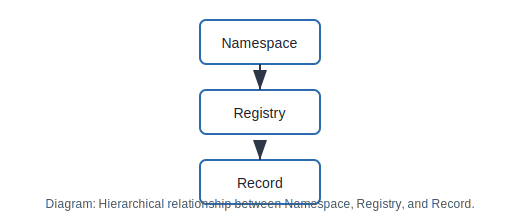

# Architecture

The **DeDi architecture** is organized into three hierarchical layers:

_Diagram: Hierarchical relationship between Namespace, Registry, and Record._

### 1. Namespace (Root Level)
Represents the root domain or trust anchor.  
Each namespace corresponds to a domain name and defines the boundary of trust for the registries it manages.

Establishing the root of trust is critical; without it, discoverable data lacks contextual integrity.  
The most common form of identity today is a domain name, which serves as the namespace identifier.  
Consequently, all DeDi-compliant APIs begin with the namespace identifier.

### 2. Registry (Intermediate Level)
A registry represents a logical grouping of records within a namespace.  
It defines the schema or structure of the data it contains.

### 3. Record (Leaf Level)
Individual entries or data points within a registry.

These three entities — **namespace**, **registry**, and **record** — are tightly coupled.  
DeDi assumes that a consumer knows which domain (namespace) and registry they intend to query.

For example, a person’s SSN could appear in multiple registries depending on context; therefore, querying without specifying the correct namespace and registry may yield meaningless results.
