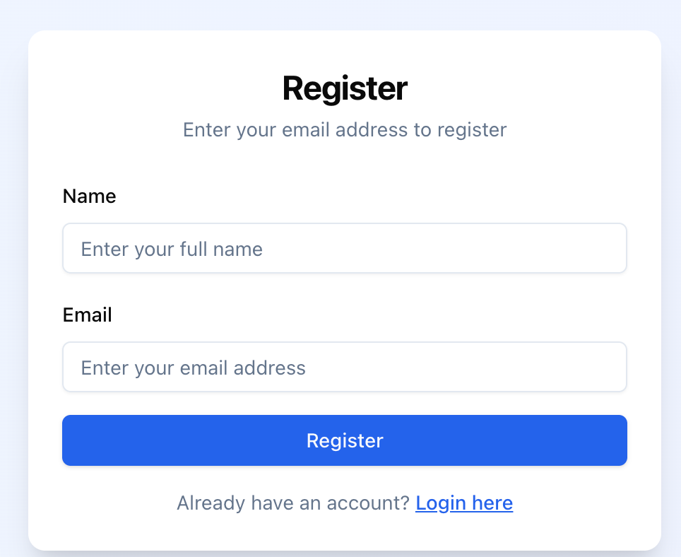

### User Guide \- DeDi.Global namespace & directory creation

---

Dedi.global is a ready to use SaaS implementing the open [DeDi protocol](https://github.com/LF-Decentralized-Trust-labs/DeDi) offered by the Network for Humanity Foundation. This allows registrars to effortlessly publish and manage their directories (aka public registries) on a robust decentralized infrastructure.

A **namespace** corresponds to a domain (and implicitly its organisation), serving as the starting point for trust. Think of it as the digital “root” under which all directories and records for that organization live.

The following are the steps to create a namespace. 

1. Users can register using (any) email to create a namespace.  

   - By default users have access to create multiple namespaces, and registries, and records within. Users can create multiple namespaces (similar to how they can own multiple domains).

2. Click on the register button on [https://publish.dedi.global/](https://publish.dedi.global/). 

3. Enter your name and email address to receive an authentication link. 

4. Create Namespace (Provide Name, Description)

5. Namespace **should be linked to a domain** to give it a “verified” status and make its contents accessible by the public. The following steps should be followed to verify a namespace \- 

   1. Enter domain name. If the domain name is part of DeDi Global’s “list of allowed domains”, a TXT record will be generated.

   2. Copy the generated TXT record as it needs to be updated in the DNS configuration file of your domain.

   3. Click “Verify” after you have successfully updated the domain’s DNS file.

A **directory** is a **list of records with a configurable schema**, essentially the structured container of public information (like a registry of network participants or sanctioned entities) that sits under a namespace. **The terms directory and registry are to be understood as equivalent and may be used interchangeably.**

6. Users can create directories (aka public registries) in a namespace. Create a registry by providing name, description and selecting a schema from the list of templates available. 

   1. List of schema templates available include: Membership, Public Key, Revocation, and Beckn One. 

   2. In the future other schemas will also be supported as long as the schema is published (ideally in a place like schema.org). 

7. Users can create records inside a directory. These records will require details as per the schema selected.

---

Video demo \- [https://www.loom.com/share/e0293309701348dc95719a98b957d12c?sid=04b8dc00-51de-46ac-82ce-adc1a0060409](https://www.loom.com/share/e0293309701348dc95719a98b957d12c?sid=04b8dc00-51de-46ac-82ce-adc1a0060409)